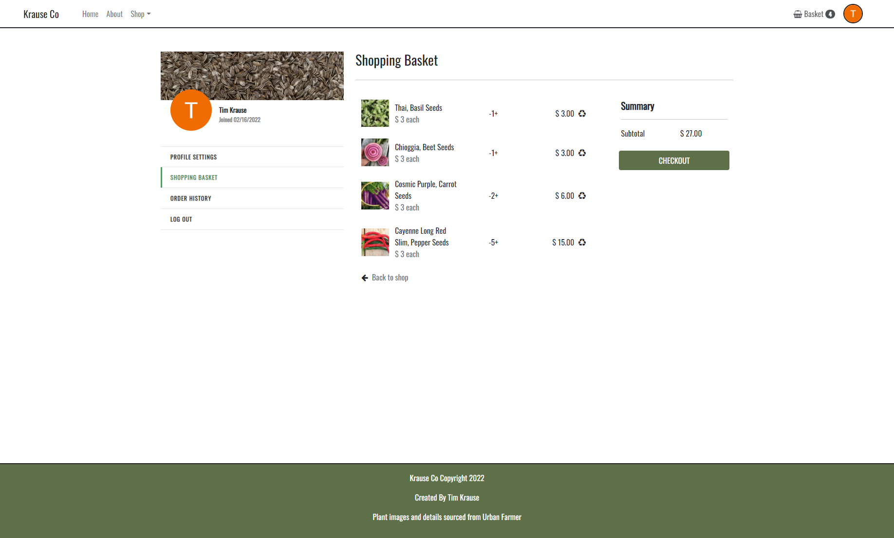

# Krause Co

Source code for [Krause Co](https://krause-co.herokuapp.com/), built using the MERN Stack.

## Overview

This e-commerce website was built on the MERN stack. Website features include: authentication; database storage using RESTful API and MongoDB for products, user's shopping sessions and order history; and a checkout flow throgh Stripe's API.

 

 

## Technology Used
The technology used to create this portfolio include:

- Node.js
- MongoDB
- Express
- React
- Redux
- React Router
- Boostrap
- SASS
- Passport
- Stripe
- Postman

## Contact
If you have any questions about the front-end project, my work or if you have any opportunities you would I would be a good fit for, please [contact me](https://timkrause.dev/#contact).